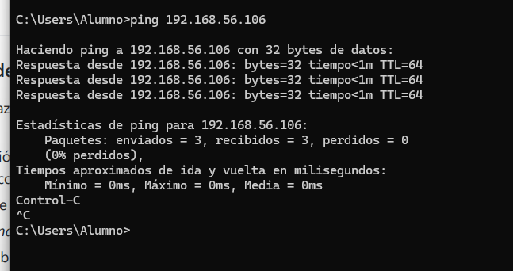
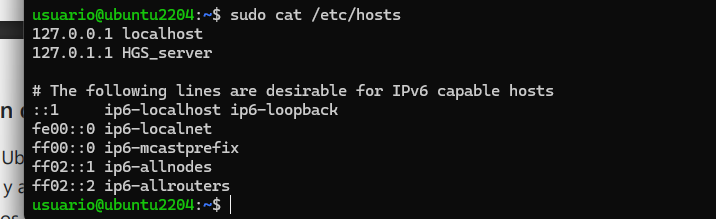
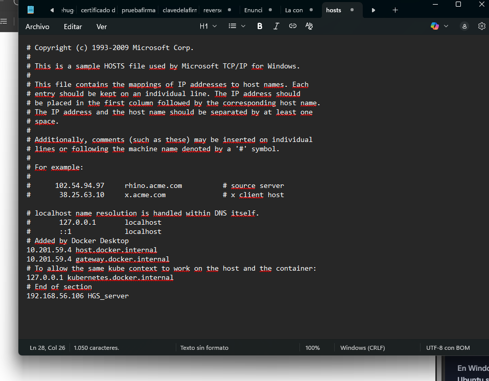
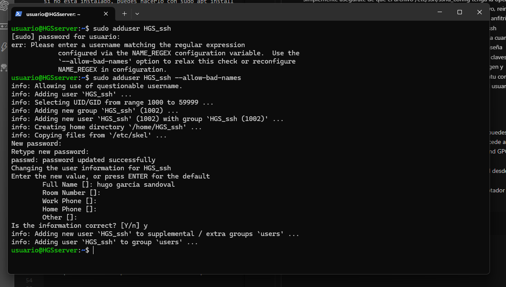
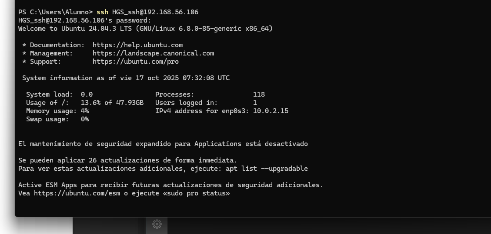
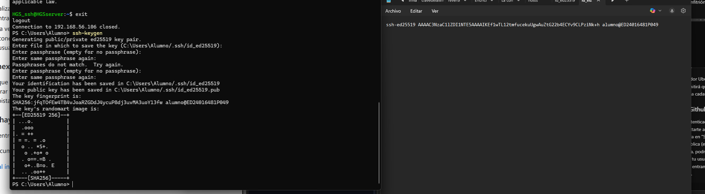
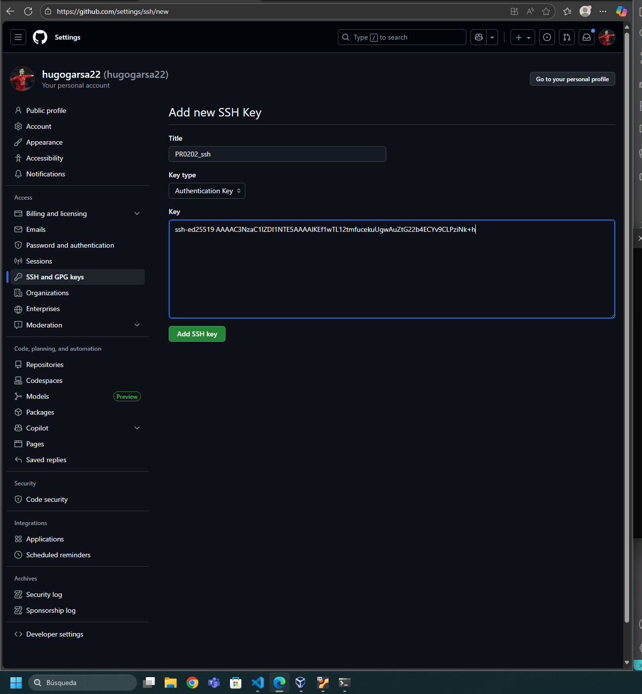
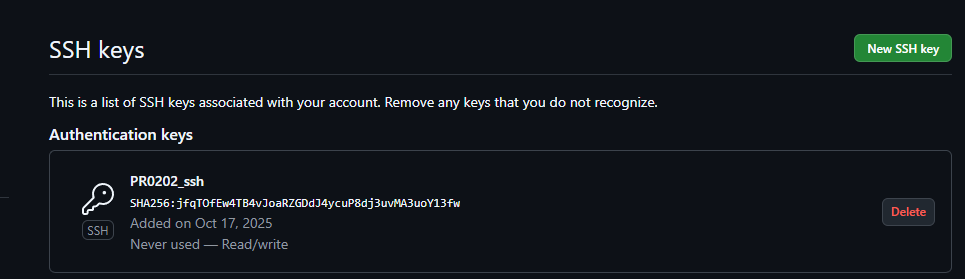

# PR0202: Conexión remota con SSH
### 1. Preparación de la máquina y configuración de la red
En la máquina virtual añadimos un nuevo adaptador de red "Adaptador solo anfitrión"


IP de la máquina virtual (Ubuntu):

La interfaz enpos8 es la que corresponde al adaptador de red en modo “red solo anfitrión”.

Su dirección IP es: 192.168.56.106

IP del adaptador en la máquina anfitrión (Windows):

  Adaptador de Ethernet VMware Network Adapter VMnet1:

    Sufijo DNS específico para la conexión. . :

    Vínculo: dirección IPv6 local fe80::8c77:8b3:b4cd:47eb%13

    Dirección IPv4.: 192.168.25.1

    Máscara de subred  : 255.255.255.0
  


Para comprobar la conectividad entre ambos equipos, abre la consola de Windows y ejecuta ping 192.168.56.106. Si recibes respuestas, significa que hay conexión entre el anfitrión y la máquina virtual.



Para cambiar el nombre del host en Ubuntu, ejecuta el comando sudo hostnamectl set-hostname HGS_server, sustituyendo “HGS” por tus iniciales. Luego edita el archivo /etc/hosts con sudo nano /etc/hosts y añade o modifica la línea 127.0.1.1 HGS_server.



En Windows, para que el nombre del servidor Ubuntu se resuelva localmente, abre el archivo hosts ubicado en C:\Windows\System32\drivers\etc\hosts con permisos de administrador y añade la línea 192.168.56.106 HGS_server. Guarda el archivo y prueba con ping HGS_server desde la consola.




### 2. Creación del usuario y conexión SSH

Para crear el usuario en Ubuntu, abre la terminal y ejecuta el comando sudo adduser HGS_ssh, sustituyendo “HGS” por tus iniciales reales. El sistema te pedirá que introduzcas una contraseña para el nuevo usuario y algunos datos opcionales como nombre completo, número de teléfono, etc.




Para permitir que el nuevo usuario se conecte mediante SSH 
con contraseña, puedes usar una herramienta como PuTTY o el
 comando ssh HGS_ssh@192.168.56.106 para conectarte
  introduciendo la contraseña cuando se te solicite



Una vez que hayas verificado que la conexión por contraseña 
funciona correctamente, puedes configurar la autenticación
mediante claves pública y privada. Para ello, desde el 
equipo anfitrión, ejecuta ssh-keygen y genera un par de 
claves.
 
 

Primero accedes al servidor Ubuntu usando SSH con contraseña, escribiendo en tu terminal ssh HGS_ssh@192.168.56.106. Una vez dentro, creas el directorio .ssh en el home del usuario si no existe, con el comando mkdir -p ~/.ssh. Luego abres el archivo authorized_keys con un editor de texto como nano ~/.ssh/authorized_keys. Dentro del editor, pegas la clave pública que tienes: ssh-ed25519 AAAAC3NzaC1lZDI1NTE5AAAAIKEf1wTL12tmfucekuUgwAuZtG22b4ECYv9CLPziNk+h. Guardas el archivo presionando Ctrl+O, luego Enter, y sales con Ctrl+X. Después aseguras los permisos del directorio y del archivo con los comandos chmod 700 ~/.ssh y chmod 600 ~/.ssh/authorized_keys. Finalmente, sales del servidor y pruebas la conexión desde tu máquina local con ssh HGS_ssh@192.168.56.106, y si todo está bien, ya no se te pedirá la contraseña.

 

### 3. Conexión transparente a Github


Cuando ya tengas configurada la autenticación por clave en Ubuntu, puedes aplicar el mismo método para conectarte a GitHub sin contraseña. Accede a tu cuenta de GitHub, ve a tu perfil, entra en “Settings” y luego en “SSH and GPG keys”. Allí puedes añadir tu clave pública (el contenido del archivo ~/.ssh/id_rsa.pub). Una vez guardada, podrás clonar, hacer push y pull desde tus repositorios sin tener que introducir tu usuario y contraseña cada vez.
.

 
 

```
