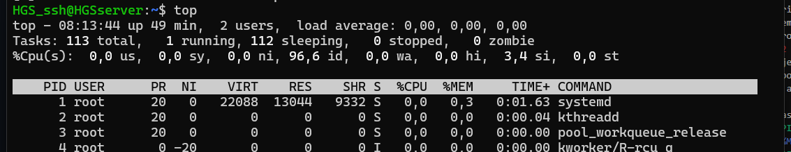

# PR0204: Gestion de procesos en Linux
## Pasos 
### 1
Se abrió una terminal en el sistema Linux y se ejecutó el comando ps para listar los procesos asociados al usuario actual. Se anotaron los PID de al menos tres procesos.
Tuve que añadir un proceso para que hubiera al menos tres.

``` bash
HGS_ssh@HGSserver:~$ ps
    PID TTY          TIME CMD
   1491 pts/0    00:00:00 bash
   1529 pts/0    00:00:00 sleep
   1530 pts/0    00:00:00 ps
HGS_ssh@HGSserver:~$

```

Se utilizó el comando ps aux para listar todos los procesos del sistema. Se identificó y anotó el PID de un proceso que no pertenecía al usuario actual.

```bash
message+     715  0.0  0.1   9784  5376 ?        Ss   07:24   0:00 @dbus-daemon --system --address
```

¿Qué diferencia hay entre ps y ps aux? 

El comando ps te muestra solo los procesos que tú estás ejecutando en ese momento desde tu terminal. Es como mirar lo que tienes abierto tú mismo. En cambio, ps aux te enseña todos los procesos que están corriendo en el sistema, aunque los haya iniciado otro usuario o no estén conectados a ninguna terminal. Es como ver todo lo que está pasando en el ordenador, no solo lo tuyo.

¿Qué implica que un proceso pertenezca a un usuario?

Cuando decimos que un proceso pertenece a un usuario, significa que ese usuario fue quien lo lanzó. Eso afecta a qué puede hacer ese proceso: solo podrá acceder a los archivos y permisos que tenga ese usuario. Además, solo ese usuario (o el administrador) puede pararlo, cambiarle la prioridad o mandarle señales. Es una forma de mantener el sistema organizado y seguro, para que cada uno tenga control sobre lo suyo y no se meta en lo de los demás.
### 2
Se ejecutó el comando top para monitorizar los procesos en tiempo real. Se identificó el proceso que consumía más CPU y se anotó su PID.

```bash
   PID USER      PR  NI    VIRT    RES    SHR S  %CPU  %MEM     TIME+ COMMAND
   1537 HGS_ssh   20   0   11904   5888   3712 R   4,8   0,1   0:00.12 top
```
Se presionó la tecla M dentro de top para ordenar los procesos por uso de memoria. Se anotó el nombre del proceso que más memoria consumía.




¿Qué columnas aparecen en top y qué significan? 

Cuando usas el comando top, te sale una lista con todos los procesos que están funcionando en ese momento. Cada fila representa un proceso, y cada columna te da información sobre él. Por ejemplo:
``` bash
PID es el número que identifica al proceso.

USER te dice qué usuario lo lanzó.

%CPU muestra cuánta CPU está usando.

%MEM indica cuánta memoria RAM está consumiendo.

COMMAND es el nombre del programa o comando que se está ejecutando.

```
Con esto puedes ver fácilmente qué está usando más recursos y quién lo está ejecutando.

¿Cómo se cambia el tiempo de actualización en top? 

Por defecto, top se actualiza cada pocos segundos. Si quieres cambiar ese ritmo, solo tienes que pulsar la tecla d mientras estás dentro de top. Te pedirá que pongas un número, que será el nuevo intervalo en segundos. Por ejemplo, si pones 1, se actualizará cada segundo.

### 3 Detener y reanudar procesos

Lo primero que hacemos es lanzar un proceso que se queda “dormido” durante 300 segundos. Para eso usamos el comando:

```bash
sleep 300 &
```
El símbolo & hace que el proceso se ejecute en segundo plano, así que podemos seguir usando la terminal sin esperar a que termine.

Para ver los trabajos que están corriendo en segundo plano, usamos:

```bash
jobs
```

Esto nos muestra una lista con los procesos que están activos. En mi caso: [1]+ Running sleep 300 & Aquí el número entre corchetes es el ID del trabajo.

Ahora vamos a parar ese proceso temporalmente. Primero buscamos su PID (identificador del proceso) con:

```bash
ps aux | grep sleep
```
En mi caso devuelve : ```bash usuario     1445  0.0  0.0   5756  2212 pts/0    S    08:52   0:00 sleep 300 ```
Una vez que tenemos el PID, lo detenemos con:

```bash
kill -SIGSTOP 1445
```
Para comprobar que el proceso está realmente detenido, usamos:

```bash
ps -o pid,stat,cmd -p 1445
```
Si en la columna STAT aparece una “T”, significa que el proceso está parado.

```bash
usuario@hugo:~$ ps -o pid,stat,cmd -p 1445
    PID STAT CMD
   1445 T    sleep 300

[1]+  Stopped                 sleep 300
```


Para que el proceso vuelva a funcionar, usamos:

```bash
kill -SIGCONT 1445
```
Y para asegurarnos de que está en marcha otra vez:

```bash
ps -o pid,stat,cmd -p 1445
```
Ahora el estado debería ser “S” (durmiendo) o “R” (ejecutándose).

En mi caso:
```bash
usuario@hugo:~$ ps -o pid,stat,cmd -p 1445
    PID STAT CMD
   1445 S    sleep 300
usuario@hugo:~$
```
Preguntas sobre este apartado

¿Qué hace la señal SIGSTOP en un proceso?
 Lo detiene completamente. El proceso se queda congelado y no puede seguir funcionando hasta que se le diga lo contrario. No puede ignorar esta señal.

¿Cómo sé si un proceso está detenido o activo?
 Usando el comando ps con la opción -o stat. Si ves una “T” en el estado, está detenido. Si ves una “S” o una “R”, está activo.

### 4 Terminar procesos
Primero creamos un proceso en segundo plano que se queda “dormido” durante 600 segundos. Usamos el siguiente comando:

```bash
sleep 600 &
```
El símbolo & hace que el proceso se ejecute en segundo plano, permitiéndonos seguir usando la terminal.

Para encontrar el PID (identificador del proceso), usamos:

```bash
ps aux | grep sleep
```
Esto nos mostrará una línea con información del proceso sleep, incluyendo su PID.
usuario     1457  0.0  0.0   5756  2212 pts/0    S    08:57   0:00 sleep 600
Para terminar el proceso de forma ordenada, usamos la señal SIGTERM:

```bash
kill -SIGTERM 1457
```
Para verificar que el proceso fue eliminado, usamos:

```bash
ps -p 1457
```
Si no aparece nada, significa que el proceso ya no está activo.
```bash
usuario@hugo:~$ ps -p 1457
    PID TTY          TIME CMD
[2]+  Terminated              sleep 600
```
¿Qué diferencia hay entre las señales SIGTERM y SIGKILL?

La señal SIGTERM solicita al proceso que finalice de forma ordenada. Esto permite que el proceso cierre correctamente sus recursos, como archivos abiertos o conexiones.
Por otro lado, SIGKILL fuerza la terminación inmediata del proceso. No le da oportunidad de realizar ninguna limpieza o cierre adecuado.

¿Por qué es preferible utilizar SIGTERM antes que SIGKILL para terminar un proceso?

Porque SIGTERM permite que el proceso finalice de manera controlada, evitando posibles pérdidas de datos o estados inconsistentes.
SIGKILL se utiliza únicamente cuando el proceso no responde a otras señales, ya que interrumpe su ejecución de forma abrupta y puede generar efectos no deseados en el sistema.

### 5 Prioridades de procesos
Creamos un proceso con prioridad baja usando el comando nice:

```bash
nice -n 10 sleep 300 &
```
El valor 10 indica una prioridad menor, lo que significa que el proceso tendrá menos preferencia para usar el CPU.

Para ver la prioridad del proceso, usamos:

```bash
ps -l
```
En la columna NI (nice value) veremos el valor asignado.
```bash
usuario@hugo:~$ ps -l
F S   UID     PID    PPID  C PRI  NI ADDR SZ WCHAN  TTY          TIME CMD
0 S  1000    1393    1392  0  80   0 -  2490 do_wai pts/0    00:00:00 bash
0 S  1000    1468    1393  0  90  10 -  1439 hrtime pts/0    00:00:00 sleep
0 R  1000    1469    1393  0  80   0 -  2459 -      pts/0    00:00:00 ps
```
Para cambiar la prioridad del proceso, usamos el comando renice. Por ejemplo, para cambiarla a 5:

```bash
sudo renice -n 5 -p 1445
```
Y verificamos el cambio con:

```bash
ps -l
```
```bash
usuario@hugo:~$ ps -l
F S   UID     PID    PPID  C PRI  NI ADDR SZ WCHAN  TTY          TIME CMD
0 S  1000    1393    1392  0  80   0 -  2490 do_wai pts/0    00:00:00 bash
0 S  1000    1468    1393  0  85   5 -  1439 hrtime pts/0    00:00:00 sleep
0 R  1000    1480    1393 99  80   0 -  2459 -      pts/0    00:00:00 ps
```

¿Para qué sirve el comando nice?

El comando nice se usa para iniciar un proceso con una prioridad específica. Sirve para indicar al sistema cuánta prioridad le debe dar a ese proceso al momento de asignar recursos del procesador. Cuanto más “agradable” (más nice) sea un proceso, menos prioridad tendrá, dejando paso a otros procesos más importantes.

¿Qué rango de valores puede tomar la prioridad (nice value) de un proceso y qué significa cada extremo?

El valor de nice puede ir desde -20 hasta 19:
-20: máxima prioridad (el proceso tendrá preferencia para usar el CPU).
0: prioridad normal (valor por defecto).
19: mínima prioridad (el proceso solo usará el CPU cuando no haya otros procesos más importantes).

¿Qué ocurre si intentas cambiar la prioridad de un proceso que no te pertenece?

El sistema no te lo permite. Solo el usuario root (administrador) puede cambiar la prioridad de procesos que pertenecen a otros usuarios. Si lo intentas sin permisos, recibirás un mensaje de error.

### 6 Procesos en primer y segundo plano
Ejecutamos un proceso en primer plano que duerme durante 200 segundos:

```bash
sleep 200
```
Mientras está corriendo, lo detenemos temporalmente con la combinación de teclas:

Ctrl + Z
Esto lo suspende y lo deja en segundo plano. Para ver los trabajos activos:

```bash
usuario@hugo:~$ jobs
[1]-  Running                 nice -n 10 sleep 300 &
[2]+  Stopped                 sleep 200
usuario@hugo:~$
```
Para reanudar el proceso en segundo plano, usamos:

```bash
usuario@hugo:~$ bg
[2]+ sleep 200 &
```
Y para traerlo de nuevo al primer plano:

```bash
usuario@hugo:~$ fg
sleep 200
```
Si hay varios trabajos en segundo plano, usamos:

```bash
fg %n
```
Donde n es el número del trabajo que queremos traer al frente.

¿Qué significa que un proceso está en segundo plano?

Un proceso en segundo plano es aquel que sigue ejecutándose pero no bloquea la terminal. Esto permite al usuario seguir escribiendo otros comandos mientras el proceso continúa trabajando.

¿Qué comando utilizarías para mover un proceso detenido a segundo plano?

El comando que se utiliza es bg. Este comando reanuda el proceso que fue detenido (por ejemplo, con Ctrl+Z) y lo coloca en segundo plano.

¿Cómo puedes traer un proceso de segundo plano a primer plano si tienes múltiples trabajos en segundo plano?

Primero se usa el comando jobs para ver la lista de trabajos en segundo plano. Luego, para traer uno al primer plano, se usa fg %n, donde n es el número del trabajo que aparece en la lista de jobs.