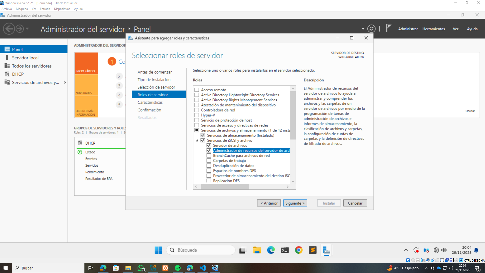
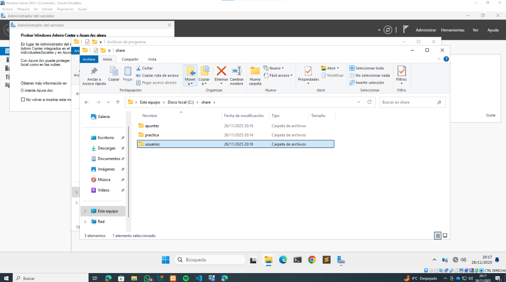
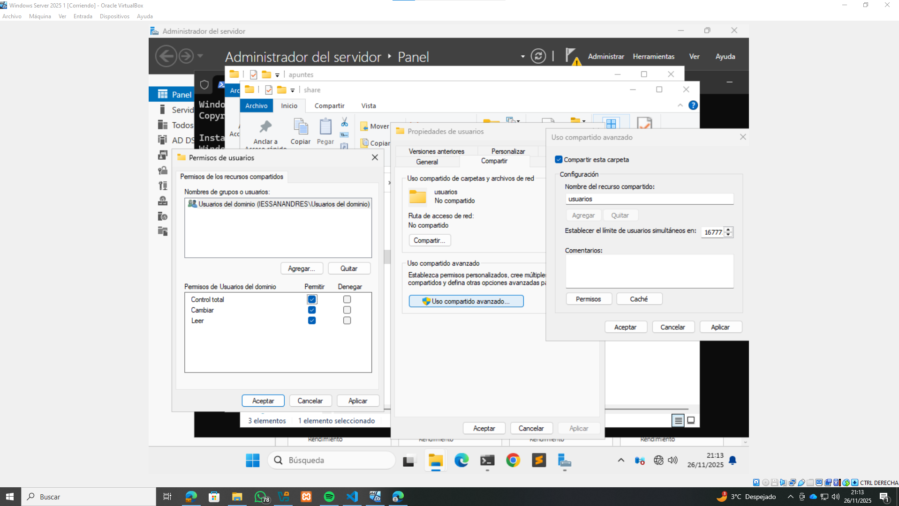
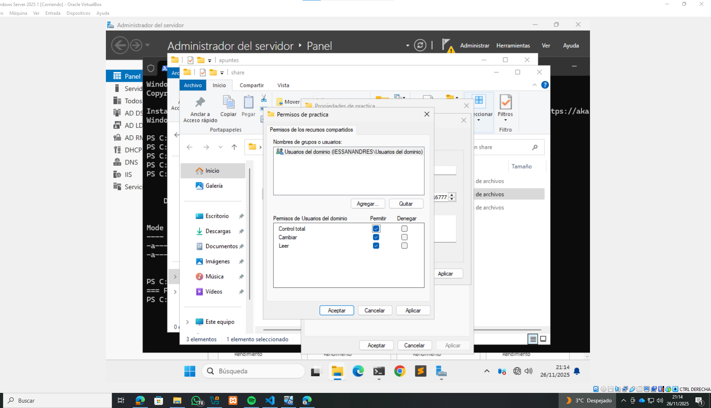
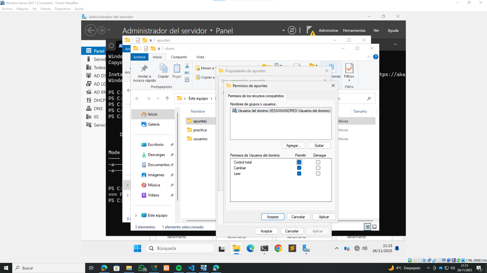
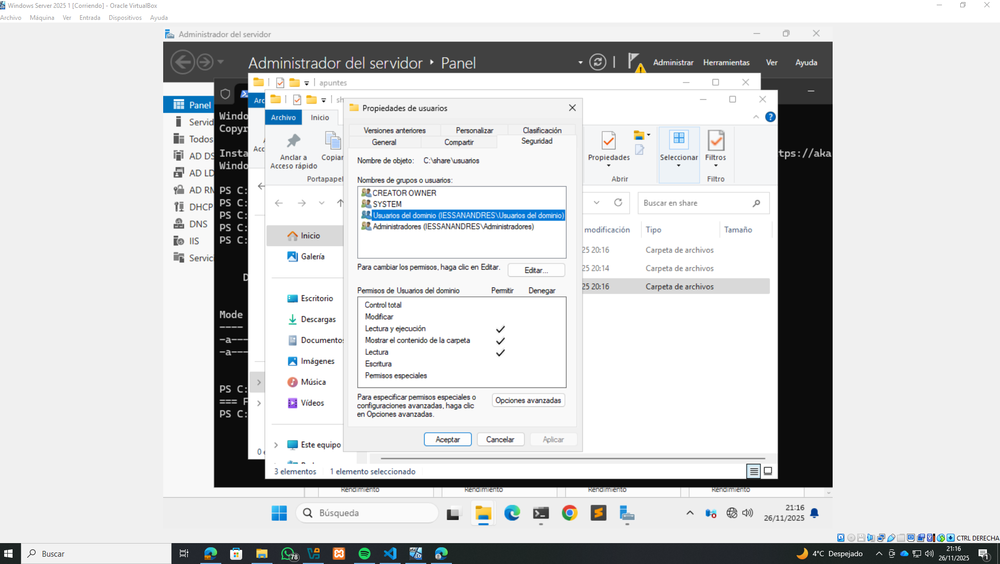
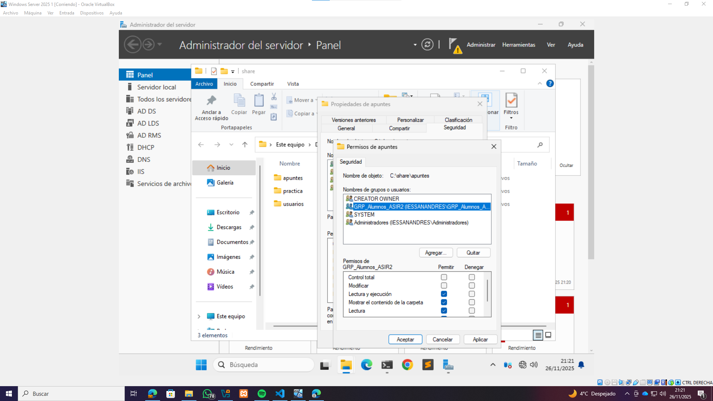
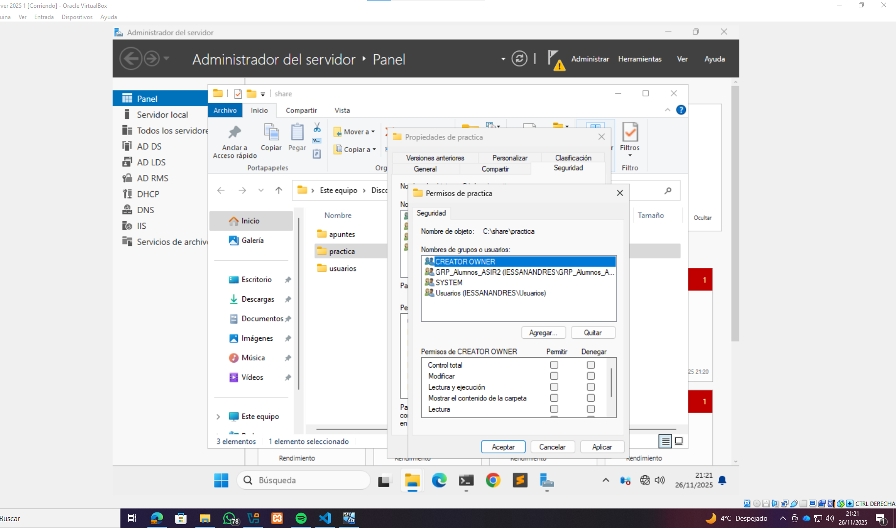
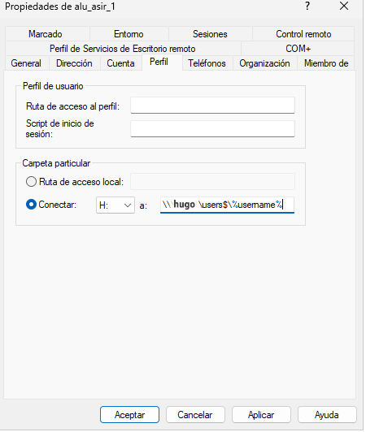

# Carpetas personales y compartidas
#A continuación se muestran las capturas tomadas durante la realización de la práctica **PR0502: Carpetas personales y compartidas por un grupo**, siguiendo paso a paso las instrucciones indicadas en el ejercicio. El proceso incluye la instalación del rol "Administrador de recursos del servidor de archivos", la creación de carpetas personales y compartidas en `C:\share`, la configuración de  seguridad para usuarios y grupos del dominio, y la asignación de unidades de red mediante Active Directory. Cada imagen documenta un paso clave del procedimiento.

## Paso1

## Paso 2

## Paso 3

## Paso 4

## Paso 5

## Paso 6

## Paso 7

## Paso 8

## Paso 9

[Volver al índice](../../index.md)