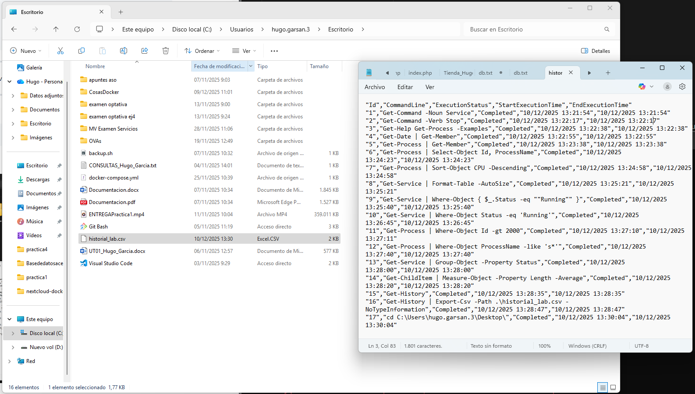

# PR0601 – Introducción a PowerShell

## 1. Descubrimiento y ayuda
### 1.1 Búsqueda por nombre (Sustantivo)  
Lista todos los comandos disponibles en el sistema que tengan la palabra **Service** en su nombre (noun).
```bash
PS C:\WINDOWS\system32> Get-Command -Noun Service

CommandType     Name                                               Version    Source
-----------     ----                                               -------    ------
Cmdlet          Get-Service                                        3.1.0.0    Microsoft.PowerShell.Management
Cmdlet          New-Service                                        3.1.0.0    Microsoft.PowerShell.Management
Cmdlet          Restart-Service                                    3.1.0.0    Microsoft.PowerShell.Management
Cmdlet          Resume-Service                                     3.1.0.0    Microsoft.PowerShell.Management
Cmdlet          Set-Service                                        3.1.0.0    Microsoft.PowerShell.Management
Cmdlet          Start-Service                                      3.1.0.0    Microsoft.PowerShell.Management
Cmdlet          Stop-Service                                       3.1.0.0    Microsoft.PowerShell.Management
Cmdlet          Suspend-Service                                    3.1.0.0    Microsoft.PowerShell.Management


PS C:\WINDOWS\system32>
```


### 1.2 Búsqueda por acción (Verbo)  
Lista todos los comandos disponibles cuya acción sea **Stop** (detener).
```bash
PS C:\WINDOWS\system32> Get-Command -Verb Stop

CommandType     Name                                               Version    Source
-----------     ----                                               -------    ------
Function        Stop-DscConfiguration                              1.1        PSDesiredStateConfiguration
Function        Stop-Dtc                                           1.0.0.0    MsDtc
Function        Stop-DtcTransactionsTraceSession                   1.0.0.0    MsDtc
Function        Stop-EtwTraceSession                               1.0.0.0    EventTracingManagement
Function        Stop-NetEventSession                               1.0.0.0    NetEventPacketCapture
Function        Stop-PcsvDevice                                    1.0.0.0    PcsvDevice
Function        Stop-ScheduledTask                                 1.0.0.0    ScheduledTasks
Function        Stop-StorageDiagnosticLog                          2.0.0.0    Storage
Function        Stop-StorageJob                                    2.0.0.0    Storage
Function        Stop-Trace                                         1.0.0.0    PSDiagnostics
Cmdlet          Stop-AppvClientConnectionGroup                     1.0.0.0    AppvClient
Cmdlet          Stop-AppvClientPackage                             1.0.0.0    AppvClient
Cmdlet          Stop-Computer                                      3.1.0.0    Microsoft.PowerShell.Management
Cmdlet          Stop-DtcDiagnosticResourceManager                  1.0.0.0    MsDtc
Cmdlet          Stop-Job                                           3.0.0.0    Microsoft.PowerShell.Core
Cmdlet          Stop-Process                                       3.1.0.0    Microsoft.PowerShell.Management
Cmdlet          Stop-ReFSDedupJob                                  2.0.0.0    Microsoft.ReFsDedup.Commands
Cmdlet          Stop-Service                                       3.1.0.0    Microsoft.PowerShell.Management
Cmdlet          Stop-Transcript                                    3.0.0.0    Microsoft.PowerShell.Host
Cmdlet          Stop-VM                                            2.0.0.0    Hyper-V
Cmdlet          Stop-VMFailover                                    2.0.0.0    Hyper-V
Cmdlet          Stop-VMInitialReplication                          2.0.0.0    Hyper-V
Cmdlet          Stop-VMReplication                                 2.0.0.0    Hyper-V
Cmdlet          Stop-VMTrace                                       2.0.0.0    Hyper-V

```
### 1.3 Uso de la ayuda  
Muestra por pantalla la ayuda detallada del comando **Get-Process**, mostrando específicamente los ejemplos de uso.
```bash
PS C:\WINDOWS\system32> Get-Help Get-Process -Examples

NOMBRE
    Get-Process

ALIAS
    gps
    ps


NOTAS
    Get-Help no encuentra los archivos de Ayuda para este cmdlet en el equipo. Mostrará solo una parte de la Ayuda.
        -- Para descargar e instalar los archivos de Ayuda para el módulo que incluye este cmdlet, use Update-Help.
        -- Para ver en línea el tema de Ayuda de este cmdlet, escriba "Get-Help Get-Process -Online" o
           vaya a https://go.microsoft.com/fwlink/?LinkID=113324.

```
---

## 2. Exploración de objetos
### 2.1 Introspección de tipos  
Ejecuta el comando **Get-Date** y canaliza su salida a **Get-Member**.  
Responde: ¿Cuál es el **TypeName** del objeto devuelto?
```bash
PS C:\WINDOWS\system32> Get-Date | Get-Member


   TypeName: System.DateTime

Name                 MemberType     Definition
----                 ----------     ----------
Add                  Method         datetime Add(timespan value)
AddDays              Method         datetime AddDays(double value)
AddHours             Method         datetime AddHours(double value)
AddMilliseconds      Method         datetime AddMilliseconds(double value)
AddMinutes           Method         datetime AddMinutes(double value)
AddMonths            Method         datetime AddMonths(int months)
AddSeconds           Method         datetime AddSeconds(double value)
AddTicks             Method         datetime AddTicks(long value)
AddYears             Method         datetime AddYears(int value)
CompareTo            Method         int CompareTo(System.Object value), int CompareTo(datetime value), int IComparable.CompareTo(Syste...
Equals               Method         bool Equals(System.Object value), bool Equals(datetime value), bool IEquatable[datetime].Equals(da...
GetDateTimeFormats   Method         string[] GetDateTimeFormats(), string[] GetDateTimeFormats(System.IFormatProvider provider), strin...
GetHashCode          Method         int GetHashCode()
GetObjectData        Method         void ISerializable.GetObjectData(System.Runtime.Serialization.SerializationInfo info, System.Runti...
GetType              Method         type GetType()
GetTypeCode          Method         System.TypeCode GetTypeCode(), System.TypeCode IConvertible.GetTypeCode()
IsDaylightSavingTime Method         bool IsDaylightSavingTime()
Subtract             Method         timespan Subtract(datetime value), datetime Subtract(timespan value)
ToBinary             Method         long ToBinary()
ToBoolean            Method         bool IConvertible.ToBoolean(System.IFormatProvider provider)
ToByte               Method         byte IConvertible.ToByte(System.IFormatProvider provider)
ToChar               Method         char IConvertible.ToChar(System.IFormatProvider provider)
ToDateTime           Method         datetime IConvertible.ToDateTime(System.IFormatProvider provider)
ToDecimal            Method         decimal IConvertible.ToDecimal(System.IFormatProvider provider)
ToDouble             Method         double IConvertible.ToDouble(System.IFormatProvider provider)
ToFileTime           Method         long ToFileTime()
ToFileTimeUtc        Method         long ToFileTimeUtc()
ToInt16              Method         int16 IConvertible.ToInt16(System.IFormatProvider provider)
ToInt32              Method         int IConvertible.ToInt32(System.IFormatProvider provider)
ToInt64              Method         long IConvertible.ToInt64(System.IFormatProvider provider)
ToLocalTime          Method         datetime ToLocalTime()
ToLongDateString     Method         string ToLongDateString()
ToLongTimeString     Method         string ToLongTimeString()
ToOADate             Method         double ToOADate()
ToSByte              Method         sbyte IConvertible.ToSByte(System.IFormatProvider provider)
ToShortDateString    Method         string ToShortDateString()
ToShortTimeString    Method         string ToShortTimeString()
ToSingle             Method         float IConvertible.ToSingle(System.IFormatProvider provider)
ToString             Method         string ToString(), string ToString(string format), string ToString(System.IFormatProvider provider...
ToType               Method         System.Object IConvertible.ToType(type conversionType, System.IFormatProvider provider)
ToUInt16             Method         uint16 IConvertible.ToUInt16(System.IFormatProvider provider)
ToUInt32             Method         uint32 IConvertible.ToUInt32(System.IFormatProvider provider)
ToUInt64             Method         uint64 IConvertible.ToUInt64(System.IFormatProvider provider)
ToUniversalTime      Method         datetime ToUniversalTime()
DisplayHint          NoteProperty   DisplayHintType DisplayHint=DateTime
Date                 Property       datetime Date {get;}
Day                  Property       int Day {get;}
DayOfWeek            Property       System.DayOfWeek DayOfWeek {get;}
DayOfYear            Property       int DayOfYear {get;}
Hour                 Property       int Hour {get;}
Kind                 Property       System.DateTimeKind Kind {get;}
Millisecond          Property       int Millisecond {get;}
Minute               Property       int Minute {get;}
Month                Property       int Month {get;}
Second               Property       int Second {get;}
Ticks                Property       long Ticks {get;}
TimeOfDay            Property       timespan TimeOfDay {get;}
Year                 Property       int Year {get;}
DateTime             ScriptProperty System.Object DateTime {get=if ((& { Set-StrictMode -Version 1; $this.DisplayHint }) -ieq  "Date")...
```
El TypeName devuelto es:
System.DateTime
### 2.2 Propiedades vs Métodos  
Usando **Get-Member** sobre un proceso cualquiera (ej: **Get-Process**), identifica el nombre de un **Método** que permita finalizar el proceso.
```bash
PS C:\WINDOWS\system32> Get-Process | Get-Member


   TypeName: System.Diagnostics.Process

Name                       MemberType     Definition
----                       ----------     ----------
Handles                    AliasProperty  Handles = Handlecount
Name                       AliasProperty  Name = ProcessName
NPM                        AliasProperty  NPM = NonpagedSystemMemorySize64
PM                         AliasProperty  PM = PagedMemorySize64
SI                         AliasProperty  SI = SessionId
VM                         AliasProperty  VM = VirtualMemorySize64
WS                         AliasProperty  WS = WorkingSet64
Disposed                   Event          System.EventHandler Disposed(System.Object, System.EventArgs)
ErrorDataReceived          Event          System.Diagnostics.DataReceivedEventHandler ErrorDataReceived(System.Object, System.Diagnost...
Exited                     Event          System.EventHandler Exited(System.Object, System.EventArgs)
OutputDataReceived         Event          System.Diagnostics.DataReceivedEventHandler OutputDataReceived(System.Object, System.Diagnos...
BeginErrorReadLine         Method         void BeginErrorReadLine()
BeginOutputReadLine        Method         void BeginOutputReadLine()
CancelErrorRead            Method         void CancelErrorRead()
CancelOutputRead           Method         void CancelOutputRead()
Close                      Method         void Close()
CloseMainWindow            Method         bool CloseMainWindow()
CreateObjRef               Method         System.Runtime.Remoting.ObjRef CreateObjRef(type requestedType)
Dispose                    Method         void Dispose(), void IDisposable.Dispose()
Equals                     Method         bool Equals(System.Object obj)
GetHashCode                Method         int GetHashCode()
GetLifetimeService         Method         System.Object GetLifetimeService()
GetType                    Method         type GetType()
InitializeLifetimeService  Method         System.Object InitializeLifetimeService()
Kill                       Method         void Kill()
Refresh                    Method         void Refresh()
Start                      Method         bool Start()
ToString                   Method         string ToString()
WaitForExit                Method         bool WaitForExit(int milliseconds), void WaitForExit()
WaitForInputIdle           Method         bool WaitForInputIdle(int milliseconds), bool WaitForInputIdle()
__NounName                 NoteProperty   string __NounName=Process
BasePriority               Property       int BasePriority {get;}
Container                  Property       System.ComponentModel.IContainer Container {get;}
EnableRaisingEvents        Property       bool EnableRaisingEvents {get;set;}
ExitCode                   Property       int ExitCode {get;}
ExitTime                   Property       datetime ExitTime {get;}
Handle                     Property       System.IntPtr Handle {get;}
HandleCount                Property       int HandleCount {get;}
HasExited                  Property       bool HasExited {get;}
Id                         Property       int Id {get;}
MachineName                Property       string MachineName {get;}
MainModule                 Property       System.Diagnostics.ProcessModule MainModule {get;}
MainWindowHandle           Property       System.IntPtr MainWindowHandle {get;}
MainWindowTitle            Property       string MainWindowTitle {get;}
MaxWorkingSet              Property       System.IntPtr MaxWorkingSet {get;set;}
MinWorkingSet              Property       System.IntPtr MinWorkingSet {get;set;}
Modules                    Property       System.Diagnostics.ProcessModuleCollection Modules {get;}
NonpagedSystemMemorySize   Property       int NonpagedSystemMemorySize {get;}
NonpagedSystemMemorySize64 Property       long NonpagedSystemMemorySize64 {get;}
PagedMemorySize            Property       int PagedMemorySize {get;}
PagedMemorySize64          Property       long PagedMemorySize64 {get;}
PagedSystemMemorySize      Property       int PagedSystemMemorySize {get;}
PagedSystemMemorySize64    Property       long PagedSystemMemorySize64 {get;}
PeakPagedMemorySize        Property       int PeakPagedMemorySize {get;}
PeakPagedMemorySize64      Property       long PeakPagedMemorySize64 {get;}
PeakVirtualMemorySize      Property       int PeakVirtualMemorySize {get;}
PeakVirtualMemorySize64    Property       long PeakVirtualMemorySize64 {get;}
PeakWorkingSet             Property       int PeakWorkingSet {get;}
PeakWorkingSet64           Property       long PeakWorkingSet64 {get;}
PriorityBoostEnabled       Property       bool PriorityBoostEnabled {get;set;}
PriorityClass              Property       System.Diagnostics.ProcessPriorityClass PriorityClass {get;set;}
PrivateMemorySize          Property       int PrivateMemorySize {get;}
PrivateMemorySize64        Property       long PrivateMemorySize64 {get;}
PrivilegedProcessorTime    Property       timespan PrivilegedProcessorTime {get;}
ProcessName                Property       string ProcessName {get;}
ProcessorAffinity          Property       System.IntPtr ProcessorAffinity {get;set;}
Responding                 Property       bool Responding {get;}
SafeHandle                 Property       Microsoft.Win32.SafeHandles.SafeProcessHandle SafeHandle {get;}
SessionId                  Property       int SessionId {get;}
Site                       Property       System.ComponentModel.ISite Site {get;set;}
StandardError              Property       System.IO.StreamReader StandardError {get;}
StandardInput              Property       System.IO.StreamWriter StandardInput {get;}
StandardOutput             Property       System.IO.StreamReader StandardOutput {get;}
StartInfo                  Property       System.Diagnostics.ProcessStartInfo StartInfo {get;set;}
StartTime                  Property       datetime StartTime {get;}
SynchronizingObject        Property       System.ComponentModel.ISynchronizeInvoke SynchronizingObject {get;set;}
Threads                    Property       System.Diagnostics.ProcessThreadCollection Threads {get;}
TotalProcessorTime         Property       timespan TotalProcessorTime {get;}
UserProcessorTime          Property       timespan UserProcessorTime {get;}
VirtualMemorySize          Property       int VirtualMemorySize {get;}
VirtualMemorySize64        Property       long VirtualMemorySize64 {get;}
WorkingSet                 Property       int WorkingSet {get;}
WorkingSet64               Property       long WorkingSet64 {get;}
PSConfiguration            PropertySet    PSConfiguration {Name, Id, PriorityClass, FileVersion}
PSResources                PropertySet    PSResources {Name, Id, Handlecount, WorkingSet, NonPagedMemorySize, PagedMemorySize, Private...
Company                    ScriptProperty System.Object Company {get=$this.Mainmodule.FileVersionInfo.CompanyName;}
CPU                        ScriptProperty System.Object CPU {get=$this.TotalProcessorTime.TotalSeconds;}
Description                ScriptProperty System.Object Description {get=$this.Mainmodule.FileVersionInfo.FileDescription;}
FileVersion                ScriptProperty System.Object FileVersion {get=$this.Mainmodule.FileVersionInfo.FileVersion;}
Path                       ScriptProperty System.Object Path {get=$this.Mainmodule.FileName;}
Product                    ScriptProperty System.Object Product {get=$this.Mainmodule.FileVersionInfo.ProductName;}
ProductVersion             ScriptProperty System.Object ProductVersion {get=$this.Mainmodule.FileVersionInfo.ProductVersion;}
```
Kill() es el nombre del método que permite finalizar el proceso.
---

## 3. El Pipeline (selección y ordenación)
### 3.1 Selección de columnas  
Obtén la lista de todos los procesos, mostrando únicamente las propiedades **Id** y **ProcessName**.
```bash
PS C:\WINDOWS\system32> Get-Process | Select-Object Id, ProcessName

   Id ProcessName
   -- -----------
16972 AdobeCollabSync
17016 AdobeCollabSync
 8492 AggregatorHost
 3896 amdfendrsr
 4428 AppHelperCap
 8928 ApplicationFrameHost
 6228 armsvc
 4268 atieclxx
 3888 atiesrxx
 3460 BridgeCommunication
11204 CcmExec
 6192 CmRcService
 2556 Code
 3352 Code
 3524 Code
 4492 Code
 7196 Code
 8264 Code
11324 Code
13432 Code
16356 Code
20656 Code
 7736 conhost
11136 conhost
12252 conhost
14256 conhost
22152 conhost
20224 CrossDeviceService
 1268 csrss
 1460 csrss
13848 ctfmon
 4440 DiagsCap
 1764 dwm
10892 explorer
 1788 fontdrvhost
 1796 fontdrvhost
 6244 HotkeyServiceDSU
 5140 HPAudioControl_19H1
 3748 HpSfuService
 4412 hpsvcsscan
    0 Idle
 2476 IntelCpHDCPSvc
 7696 IntelGraphicsSoftware.Service
 6784 jhi_service
 8796 LanWlanWwanSwitchingServiceDSU
 7208 LMS
11764 LockApp
 1608 LsaIso
 1620 lsass
20728 M365Copilot
 4504 Memory Compression
14112 MicrosoftStartFeedProvider
 6388 MpDefenderCoreService
 1112 msedge
 1908 msedge
 2040 msedge
 2072 msedge
```
### 3.2 Ordenación básica  
Lista todos los procesos del sistema, ordenados por su consumo de **CPU** de forma descendente.
```bash
PS C:\WINDOWS\system32> Get-Process | Sort-Object CPU -Descending

Handles  NPM(K)    PM(K)      WS(K)     CPU(s)     Id  SI ProcessName
-------  ------    -----      -----     ------     --  -- -----------
   1683      62   590076     289372      85,45   2212   1 msedge
    507      51   294568     345860      44,69  16356   1 Code
   2456     100   136044     297888      37,73  15288   1 msedge
    403      59   328344      12252      30,30  19324   1 msedge
    404      55   361920      51048      27,48  18384   1 msedgewebview2
   1441      35   167992     141132      19,05   8264   1 Code
    589      27    23672      60228      16,31  17016   1 AdobeCollabSync
    466      29   107432     162552      15,39  17428   1 msedgewebview2
   1373      55    57780      33644      13,81  17668   1 msedgewebview2
   1573      39   146496     138340      13,72  17468   1 msedgewebview2
   6055     107   150956     374432      13,14  10892   1 explorer
    380      28    98992     178512      11,05  10988   1 msedge
    388      32   237684     293796      11,02  10400   1 msedge
   1214      67   107028     162232      10,67   3352   1 Code
    486      57   449176     470376      10,66  11324   1 Code
    422      32    21872      56584       9,36   2040   1 msedge
    313      24   141248     184272       7,95  14756   1 msedge
    460      29    40116      46080       5,88  12852   1 PrivacyIconClient
```
### 3.3 Formato de tabla  
Obtén los servicios del sistema y fuerza la salida para que se muestre como una tabla (**Format-Table**) con **-AutoSize**.
```bash
PS C:\WINDOWS\system32> Get-Service | Format-Table -AutoSize

Status  Name                                      DisplayName
------  ----                                      -----------
Stopped AarSvc_144234                             Agent Activation Runtime_144234
Running AdobeARMservice                           Adobe Acrobat Update Service
Stopped ADPSvc                                    ADPSvc
Stopped ALG                                       Servicio de puerta de enlace de nivel de aplicación
Running AMD Crash Defender Service                AMD Crash Defender Service
Running AMD External Events Utility               AMD External Events Utility
Stopped AppIDSvc                                  Identidad de aplicación
Running Appinfo                                   Información de la aplicación
Stopped AppMgmt                                   Administración de aplicaciones
Stopped AppReadiness                              Preparación de aplicaciones
Stopped AppVClient                                Microsoft App-V Client
Running AppXSvc                                   Servicio de implementación de AppX (AppXSVC)
Stopped ApxSvc                                    Servicio de proxy de dispositivo de audio virtual de Windows
Stopped AssignedAccessManagerSvc                  Servicio AssignedAccessManager
Running AudioEndpointBuilder                      Compilador de extremo de audio de Windows
Running Audiosrv                                  Audio de Windows
Stopped autotimesvc                               Hora de la red de telefonía móvil
Stopped AxInstSV                                  Instalador de ActiveX (AxInstSV)
Stopped BcastDVRUserService_144234                Servicio de usuario de difusión y GameDVR_144234
Stopped BDESVC                                    Servicio Cifrado de unidad BitLocker
Running BFE                                       Motor de filtrado de base
Stopped BITS                                      Servicio de transferencia inteligente en segundo plano (BITS)
Stopped BluetoothUserService_144234               Servicio de soporte técnico de usuario de Bluetooth_144234
Running BrokerInfrastructure                      Servicio de infraestructura de tareas en segundo plano
Running Browser                                   Examinador de equipos
Stopped BTAGService                               Servicio de puerta de enlace de audio de Bluetooth
Stopped BthAvctpSvc                               Servicio AVCTP
Stopped bthserv                                   Servicio de compatibilidad con Bluetooth
Running camsvc                                    Servicio Administrador de funcionalidad de acceso
Stopped CaptureService_144234                     CaptureService_144234
Running cbdhsvc_144234                            Servicio de usuario del portapapeles_144234
Running CcmExec                                   Host de agente de SMS
Running CDPSvc                                    Servicio de plataforma de dispositivos conectados
Running CDPUserSvc_144234                         Servicio de usuario de plataforma de dispositivos conectados_144234
Running CertPropSvc                               Propagación de certificados
Running ClickToRunSvc                             Microsoft Office Click-to-Run Service
Stopped ClipSVC                                   Servicio de licencia de cliente (ClipSVC)
Stopped CloudBackupRestoreSvc_144234              Servicio de copia de seguridad y restauración en la nube_144234
Stopped cloudidsvc                                Servicio de identidad en la nube de Microsoft
```
---

## 4. Filtrado y lógica (Where-Object)
### 4.1 Filtrado exacto  
Muestra los servicios cuyo estado (**Status**) sea exactamente igual a “Running”.
```bash
PS C:\WINDOWS\system32> Get-Service | Where-Object Status -eq 'Running'

Status   Name               DisplayName
------   ----               -----------
Running  AdobeARMservice    Adobe Acrobat Update Service
Running  AMD Crash Defen... AMD Crash Defender Service
Running  AMD External Ev... AMD External Events Utility
Running  Appinfo            Información de la aplicación
Running  AppXSvc            Servicio de implementación de AppX ...
Running  AudioEndpointBu... Compilador de extremo de audio de W...
Running  Audiosrv           Audio de Windows
Running  BFE                Motor de filtrado de base
Running  BrokerInfrastru... Servicio de infraestructura de tare...
Running  Browser            Examinador de equipos
Running  camsvc             Servicio Administrador de funcional...
Running  cbdhsvc_144234     Servicio de usuario del portapapele...
Running  CcmExec            Host de agente de SMS
Running  CDPSvc             Servicio de plataforma de dispositi...
Running  CDPUserSvc_144234  Servicio de usuario de plataforma d...
Running  CertPropSvc        Propagación de certificados
Running  ClickToRunSvc      Microsoft Office Click-to-Run Service
Running  CmRcService        Control remoto de Configuration Man...
Running  CoreMessagingRe... CoreMessaging
Running  cplspcon           Intel(R) Content Protection HDCP Se...
Running  CryptSvc           Servicios de cifrado
Running  DcomLaunch         Iniciador de procesos de servidor DCOM
Running  DeviceAssociati... Servicio de asociación de dispositivos
Running  Dhcp               Cliente DHCP
Running  DiagTrack          Experiencias del usuario y telemetr...
Running  DispBrokerDeskt... Servicio de directivas de pantallas
Running  DisplayEnhancem... Servicio de mejora de visualización
Running  Dnscache           Cliente DNS
Running  DoSvc              Optimización de distribución
Running  DPS                Servicio de directivas de diagnóstico
Running  DsSvc              Servicio de uso compartido de datos
Running  DusmSvc            Uso de datos
Running  EventLog           Registro de eventos de Windows
Running  EventSystem        Sistema de eventos COM+
Running  FontCache          Servicio de caché de fuentes de Win...
Running  gpsvc              Cliente de directiva de grupo
Running  hidserv            Servicio de dispositivo de interfaz...
Running  HNS                Servicio de red de host
Running  HotKeyServiceDSU   HP DSU Service
Running  HPAppHelperCap     HP App Helper HSA Service
Running  HPDiagsCap         HP Diagnostics HSA Service
Running  HPNetworkCap       HP Network HSA Service
Running  hpsvcsscan         HP Services Scan
Running  HPSysInfoCap       HP System Info HSA Service
Running  HpTouchpointAna... HP Insights Analytics
Running  HvHost             Servicio de host HV
Running  InstallService     Servicio de instalación de Microsof...
Running  IntelGraphicsSo... Intel® Graphics Software
Running  iphlpsvc           Aplicación auxiliar IP
Running  jhi_service        Intel(R) Dynamic Application Loader...
Running  KeyIso             Aislamiento de claves CNG
Running  LanmanServer       Servidor
Running  LanmanWorkstation  Estación de trabajo
Running  LanWlanWwanSwit... HP DSU LAN/WLAN/WWAN Switching Service
Running  lfsvc              Servicio de geolocalización
Running  LicenseManager     Servicio de administrador de licenc...
Running  lmhosts            Aplicación auxiliar de NetBIOS sobr...
Running  LMS                Intel(R) Management and Security Ap...
Running  LSM                Administrador de sesión local
Running  MDCoreSvc          Servicio principal de Microsoft Def...
Running  mpssvc             Firewall de Windows Defender
Running  NcbService         Agente de conexión de red
Running  Netlogon           Net Logon
Running  netprofm           Servicio de lista de redes
Running  NPSMSvc_144234     Reproducción del Servicio administr...
Running  nsi                Servicio Interfaz de almacenamiento...
Running  nvagent            Servicio de virtualización de red
Running  OCS Inventory S... OCS Inventory Service
Running  OneSyncSvc_144234  Sincronizar host_144234
Running  PcaSvc             Servicio Asistente para la compatib...
Running  PimIndexMainten... Datos de contactos_144234
Running  PlugPlay           Plug and Play
Running  PolicyAgent        Agente de directiva IPsec
Running  Power              Energía
Running  ProfSvc            Servicio de perfil de usuario
Running  RasMan             Administrador de conexiones de acce...
Running  RmSvc              Servicio de administración de radio
Running  RpcEptMapper       Asignador de extremos de RPC
Running  RpcSs              Llamada a procedimiento remoto (RPC)
Running  RtkAudioUnivers... Realtek Audio Universal Service
Running  SamSs              Administrador de cuentas de seguridad
Running  Schedule           Programador de tareas
Running  SECOMNService      Sound Research SECOMN Service
Running  SecurityHealthS... Servicio Seguridad de Windows
Running  SENS               Servicio de notificación de eventos...
Running  SessionEnv         Configuración de Escritorio remoto
Running  SFUService         HP SFU Service
Running  SharedAccess       Conexión compartida a Internet (ICS)
Running  ShellHWDetection   Detección de hardware shell
Running  Spooler            Cola de impresión
Running  SSDPSRV            Detección SSDP
Running  SstpSvc            Servicio de protocolo de túnel de s...
Running  StateRepository    Servicio de repositorio de estado
Running  StiSvc             Adquisición de imágenes de Windows ...
Running  StorSvc            Servicio de almacenamiento
Running  SysMain            SysMain
Running  SystemEventsBroker Agente de eventos del sistema
Running  TermService        Servicios de Escritorio remoto
Running  TextInputManage... Servicio de administración de entra...
Running  Themes             Temas
Running  TimeBrokerSvc      Agente de eventos de tiempo
Running  TokenBroker        Administrador de cuentas web
Running  TrkWks             Cliente de seguimiento de vínculos ...
Running  UdkUserSvc_144234  Servicio de usuario de Udk_144234
Running  UmRdpService       Redirector de puerto en modo usuari...
Running  UnistoreSvc_144234 Almacenamiento de datos de usuarios...
Running  UserDataSvc_144234 Acceso a datos de usuarios_144234
Running  UserManager        Administrador de usuarios
Running  UsoSvc             Servicio orquestador de actualizaci...
Running  VaultSvc           Administrador de credenciales
Running  VeyonService       Veyon Service
Running  vmcompute          Servicio de proceso de host de Hyper-V
Running  vmms               Administración de máquinas virtuale...
Running  W32Time            Hora de Windows
Running  Wcmsvc             Administrador de conexiones de Windows
Running  WdNisSvc           Servicio de inspección de red de An...
Running  webthreatdefsvc    Servicio de defensa contra amenazas...
Running  webthreatdefuse... Servicio de usuario de defensa cont...
Running  whesvc             Estado y experiencias optimizadas d...
Running  WinDefend          Servicio Antivirus de Microsoft Def...
Running  WinHttpAutoProx... Servicio de detección automática de...
Running  Winmgmt            Instrumental de administración de W...
Running  WlanSvc            Configuración automática de WLAN
Running  WMIRegistration... Intel(R) Management Engine WMI Prov...
Running  WpnService         Servicio del sistema de notificacio...
Running  WpnUserService_... Servicio de usuario de notificacion...
Running  WSAIFabricSvc      WSAIFabricSvc
Running  wscsvc             Centro de seguridad
Running  WSearch            Windows Search
Running  WSLService         WSL Service
Running  WwanSvc            Configuración automática de WWAN
Running  XTU3SERVICE        XTUOCDriverService
```
### 4.2 Filtrado numérico  
Lista los procesos cuyo identificador (**Id**) sea mayor que 2000.
```bash
PS C:\WINDOWS\system32> Get-Process | Where-Object Id -gt 2000

Handles  NPM(K)    PM(K)      WS(K)     CPU(s)     Id  SI ProcessName
-------  ------    -----      -----     ------     --  -- -----------
    318      17     7116      34248       0,05  16972   1 AdobeCollabSync
    589      27    23668      60228      16,63  17016   1 AdobeCollabSync
    160      10     3068      13060              8492   0 AggregatorHost
    155      11     2592       9700              3896   0 amdfendrsr
    422      20     5100      22540              4428   0 AppHelperCap
   1298      30    38104      66192       0,27   8928   1 ApplicationFrameHost
    141      11     1984       8584              6228   0 armsvc
    386      18     5260      21772              4268   1 atieclxx
    212      12     2240       9204              3888   0 atiesrxx
    412      20     4992      32600       0,14   3460   1 BridgeCommunication
   1446      49    22560      68116             11204   0 CcmExec
    280      19    24392      17296              6192   0 CmRcService
    333      29    82160     121800       0,84   2556   1 Code
   1212      67   107308     161868      11,86   3352   1 Code
    189      20    32764     107972       0,56   3524   1 Code
    229      13    10796      32708       0,02   4492   1 Code
    358      35    97172     119228       1,44   7196   1 Code
   1441      34   151688     140780      22,63   8264   1 Code
    489      54   339604     368756      12,89  11324   1 Code
    352      21    14436      49364       0,47  13432   1 Code
    507      51   301440     349012      52,31  16356   1 Code
    339      30    82372     114268       2,84  20656   1 Code
     78       8     1136       6820              7736   0 conhost
    108      10     1388       8436       0,03  11136   1 conhost
     98       8     1244       7696       0,02  12252   1 conhost
    142      11     1668      11496             14256   0 conhost
    141      10     1564      10652       0,00  22152   1 conhost
   1046      73    23704      93032       1,16  20224   1 CrossDeviceService
    546      22     7136      37820       1,98  13848   1 ctfmon
    333      19    21040      38916              4440   0 DiagsCap
   6095     107   154296     378064      14,28  10892   1 explorer
    291      17    18788      22684              6244   0 HotkeyServiceDSU
   1532      41    50072      95772       0,48   5140   1 HPAudioControl_19H1
    146      10     1932      11032              3748   0 HpSfuService
    574      28    41012      57216              4412   0 hpsvcsscan
    151       9     1724       8140              2476   0 IntelCpHDCPSvc
    690      47    12668      46464              7696   0 IntelGraphicsSoftware.Service
    146      10     1680       8936              6784   0 jhi_service
    244      13     2868      15568              8796   0 LanWlanWwanSwitchingServiceDSU
    425      33     7860      22116              7208   0 LMS
   1409      33    36868      93032       0,47  11764   1 LockApp
   2915      69    92540     167148       1,25  20728   1 M365Copilot
      0       0      536     164108              4504   0 Memory Compression
    600      25     9400      48956       1,56  14112   1 MicrosoftStartFeedProvider
    505      19    14156      32244              6388   0 MpDefenderCoreService
    487      44    22548      57120       9,94   2040   1 msedge
    568      37   145880     209124       5,89   2072   1 msedge
   1700      63   558772     288084      88,94   2212   1 msedge
    265      22    24904      62656       0,36   3548   1 msedge
    306      23    28264      70392       0,50   3760   1 msedge
    320      23    30044      72180       0,48   5320   1 msedge
    315      23    33892      77116       0,97   6640   1 msedge
    256      17     9840      32536       0,28   8512   1 msedge
    242      16     8836      27084       0,20   8628   1 msedge
    168      13     8424      21912       0,03   8836   1 msedge
   1122      33    40580      64148       0,17   9024   1 msedge
    382      32   236252     290204      13,25  10400   1 msedge
    380      28   101568     180884      11,06  10988   1 msedge
    198      14    11720      27000       0,42  11836   1 msedge
    313      24   140652     183556       8,02  14756   1 msedge
   2567     108   139492     302592      43,27  15288   1 msedge
    287      11     2396      12644       0,03  15324   1 msedge
    209      18    16180      34416       0,06  15576   1 msedge
    421      28    71236      42508       2,73  16568   1 msedge
    407      28    69660      17016       1,61  16616   1 msedge
    275      22    26868      26220       0,47  18576   1 msedge
    403      59   328344      12252      30,30  19324   1 msedge
    278      22    27256      10200       0,39  19984   1 msedge
    324      24    39440      83696       1,72  20712   1 msedge
    146      10     2236      11912       0,02   4476   1 msedgewebview2
    166      11     8832       3880       0,05   5028   1 msedgewebview2
    145      10     2256      11852       0,06  12788   1 msedgewebview2
   1143      51    39592     124036       2,53  13304   1 msedgewebview2
   1397      34    93644      97480       2,38  13648   1 msedgewebview2
    344      20    13288      43016       0,73  13676   1 msedgewebview2
    163      11     8828      23020       0,11  13788   1 msedgewebview2
   1528      35    96844      34972       2,23  13916   1 msedgewebview2
    380      33    71384     124092       2,28  14228   1 msedgewebview2
    344      20    11268      14352       0,33  16728   1 msedgewebview2
   1449      58    47480     141060       3,41  16756   1 msedgewebview2
    153      10     2276      11948       0,05  16868   1 msedgewebview2
    243      19    20780      48712       0,13  17420   1 msedgewebview2
    466      29   107432     162552      15,39  17428   1 msedgewebview2
   1573      39   146496     138340      13,75  17468   1 msedgewebview2
   1373      55    57760      37624      13,88  17668   1 msedgewebview2
    153      10     2220      11908       0,03  17688   1 msedgewebview2
   1645      44   108428       8044       3,41  17872   1 msedgewebview2
    364      22    13188      13868       1,77  17888   1 msedgewebview2
    181      12     9540       5580       0,31  17944   1 msedgewebview2
    404      55   362240      69560      27,59  18384   1 msedgewebview2
    383      22    14012      45020       0,92  18672   1 msedgewebview2
    181      12    10352      24940       0,16  18676   1 msedgewebview2
    241      16     8984       2852       0,63  19232   1 msedgewebview2
    356      27    46848       6864       1,34  20972   1 msedgewebview2
   1180     248   370724     374300              6072   0 MsMpEng
   1221      60    41688      52080       5,88  11992   1 ms-teams
   2037      74   125828      43924       5,53  18976   1 ms-teams
    359      21     5784      34748              4404   0 NetworkCap
    214      32     4520      15240             10180   0 NisSrv
    276      18     3348      15332              6204   0 OcsService
    196      16     2628      14452       0,52  21328   1 OcsSystray
   2839      71   122104     195108       3,11   9820   1 OneDrive
    586      32    61752      83236       2,14  21840   1 OneDrive.Sync.Service
    274      14     3136      19260       0,31   3416   1 OpenConsole
    671      31    71352      90600       0,75   2376   1 powershell
    697      32    71468      95200       1,42   8212   1 powershell
    271      11     7844      17508              8420   0 PresentMonService
    460      29    40512      46484       5,97  12852   1 PrivacyIconClient
    407      16    15884      17904              2892   0 RtkAudUService64
    439      17    16064      27084       0,67  15056   1 RtkAudUService64
    147       8     1812      11124       0,05   3064   1 RuntimeBroker
    267      14     3596      27124       0,16   7280   1 RuntimeBroker
    160      11     2476      14648       0,03  12280   1 RuntimeBroker
    791      33    14580      65800       3,20  12396   1 RuntimeBroker
    424      24     9304      46708       1,72  12580   1 RuntimeBroker
    164      11     3152      15528       0,06  13188   1 RuntimeBroker
    160      11     2484      14672       0,16  14776   1 RuntimeBroker
    139       9     2148      12204       0,03  17504   1 RuntimeBroker
    303      16     5940      31584       0,33  17604   1 RuntimeBroker
    441      21     6628      41472       0,84  19532   1 RuntimeBroker
    411      27    50356      61992       0,53   6644   1 SCNotification
   1921      57    67188     151320       3,61  11632   1 SearchHost
    882      21    22228      43276             10524   0 SearchIndexer
    261      10     1788      10400       0,03   4304   1 SearchProtocolHost
    368      13     4224      18860       0,33  12244   1 SECOCL64
    593      15     8080      20540              6216   0 SECOMN64
    579      23     8912      26016             14936   0 SecurityHealthService
    183      11     2116      13496       0,03  14912   1 SecurityHealthSystray
   1541      39    41640      97252       0,56  17360   1 ShellExperienceHost
   1013      29    32792      66100       0,25   5516   1 ShellHost
    750      24     7860      50680       5,33  11152   1 sihost
    177      11     3084      13744       0,06  14864   1 smartscreen
    444      22     6208      22120              7072   0 spoolsv
   1866      51    76632     148852       1,72   6460   1 StartMenuExperienceHost
    214      13     1964      10644              2084   0 svchost
    140      10     2000       8728              2092   0 svchost
    163      33     6920      12684              2100   0 svchost
    436      19     3964      12772              2204   0 svchost
    197      11     2740      14184              2280   0 svchost
    262      15     3448      14392              2284   0 svchost
    324      10     2344      15416              2296   0 svchost
    334      16     6524      17112              2308   0 svchost
    251      12     2856      10868              2316   0 svchost
    261      12     3312      15780              2496   0 svchost
    125      11     1836       7888              2508   0 svchost
   1302      25     7228      23680              2596   0 svchost
    475      34    22508      37252              2628   0 svchost
    180       8     1996       8376              2952   0 svchost
    767      32    25068      57124              2972   0 svchost
    176      10     1960      10156              2988   0 svchost
    191      10     2136      10192              3164   0 svchost
    186      10     2028      10500              3364   0 svchost
    341      14     4388      17148              3440   0 svchost
   2405      18    23088      37728              3472   0 svchost
    387      21     3172      14684              3500   0 svchost
    232      14     2496      12644              3624   0 svchost
    135       9     1820       9472              3688   0 svchost
    394      20    37020      47124              3740   0 svchost
    266      17     2976      14668              3780   0 svchost
    229      16    11268      22232              3808   0 svchost
    486      15    19336      25596              3880   0 svchost
    484      19     5192      26664              3996   0 svchost
    182      10     2332      10880              4060   0 svchost
    197      16     7944      15364              4208   0 svchost
    232      15     2580      13020              4244   0 svchost
    227      13     2644      18796              4252   0 svchost
    278       8     1760       7956              4260   0 svchost
    192      12     2404      10200              4380   0 svchost
    219      11     2364      11636              4388   0 svchost
    427      14     3748      19152              4648   0 svchost
    433      29     8988      24376              4720   0 svchost
    333      10    14216      25844              4828   0 svchost
    140       8     1652       7964              4876   0 svchost
    128       9     1776       9336              4948   0 svchost
    360      17     6076      29860              5156   0 svchost
    214      13     2592      12372              5956   0 svchost
    131       9     2016      10388              6048   0 svchost
    237      12     2692      11512              6088   0 svchost
    406      19     4616      25792              6296   0 svchost
    189      11     2340      12092              6372   0 svchost
    166      20     2036       9968              6412   0 svchost
    163      11     2136      10156              6420   0 svchost
    479      21    11656      29504              6596   0 svchost
    165      10     1848       9476              6756   0 svchost
    221      12     2560      13460              6856   0 svchost
    511      16     3404      15244              6864   0 svchost
    241      16     3176      19056              6912   0 svchost
    182      10     2084       9984              7784   0 svchost
    308      15     3908      20244              7944   0 svchost
    139       9     2304      11096       0,14   8012   1 svchost
    410      18     7844      39268       1,58   8296   1 svchost
    272      19     3840      16352              8328   0 svchost
    460      25     5932      21832              8376   0 svchost
    251      13     8468      19044              9908   0 svchost
    436      21     5676      24832             10608   0 svchost
    489      20     9668      33432             10712   0 svchost
    485      19     6768      30244       1,06  11196   1 svchost
    175      12     5832      18516             11556   0 svchost
    304      15     4336      26572       0,47  11716   1 svchost
    241      13     2932      16540             11844   0 svchost
    413      25     3884      17216             12368   0 svchost
    267      15     3896      24308       0,22  12408   1 svchost
    294      17     4736      20440             13196   0 svchost
    273      14     3400      16632             14364   0 svchost
    173      10     2500      16300       0,08  15068   1 svchost
    244      20     2460      11020             15956   0 svchost
    242      14     3440      15916             16720   0 svchost
    199      11     2840      15392             17084   0 svchost
    403      21     9304      34552             18536   0 svchost
    399      24     5592      24400       0,61  21208   1 svchost
    202      14     4852      18532             21624   0 svchost
    214      13     3428      14252             21796   0 svchost
    333      13     3100      12556             22364   0 svchost
    612      33   210576     247432              4420   0 SysInfoCap
   2228      70    68424       6464       0,86   6672   1 SystemSettings
    281      39     8784      22848       0,78  11108   1 taskhostw
    937      51    57432      81548              4396   0 TouchpointAnalyticsClientService
    138       9     1760       9600              5440   0 unsecapp
    504      38    76560      90312             13392   1 veyon-server
    307      21     7824      25464              6056   0 veyon-service
    473      34    78528      90708       0,30  14808   1 veyon-worker
    166      10     2316      13588              4792   0 vmcompute
    599      29    42724      42724              3552   0 vmms
   2285      60    75952     135420       1,92  12504   1 WidgetBoard
    354      20     5844      29632       0,94  12812   1 WidgetService
   2175      42    68020     112540       9,75   9316   1 WindowsTerminal
    451      25    18092      41352              5296   0 WmiPrvSE
    291      20    14128      30200              5560   0 WmiPrvSE
    195      13     4196      14812             10292   0 WmiPrvSE
    236      17     4708      15120             10912   0 WmiPrvSE
    272      18     5140      21448             18720   0 WmiPrvSE
    579      30    67912      87972             21648   0 WmiPrvSE
    176      11     3452      13184             22304   0 WmiPrvSE
    275      15     3332      16796              6232   0 WMIRegistrationService
    459      21     5320      28420              6264   0 wslservice
    634      35    86144     103416              6288   0 XtuService
```
### 4.3 Filtrado con comodines  
Muestra los procesos cuyo nombre (**Name**) comience por la letra “s” usando **-like** y el comodín adecuado.
```bash
PS C:\WINDOWS\system32> Get-Process | Where-Object ProcessName -like 's*'

Handles  NPM(K)    PM(K)      WS(K)     CPU(s)     Id  SI ProcessName
-------  ------    -----      -----     ------     --  -- -----------
    411      27    50356      61992       0,53   6644   1 SCNotification
   1921      57    67188     151320       3,63  11632   1 SearchHost
    886      21    22232      43280             10524   0 SearchIndexer
    261      10     1736      10400       0,03   4304   1 SearchProtocolHost
    368      13     4224      18860       0,33  12244   1 SECOCL64
    593      15     8080      20540              6216   0 SECOMN64
      0       0      176     110456               284   0 Secure System
    578      23     8880      25984             14936   0 SecurityHealthService
    183      11     2116      13496       0,03  14912   1 SecurityHealthSystray
    965      21     8076      24880              1528   0 services
   1541      39    41640      97208       0,56  17360   1 ShellExperienceHost
   1013      29    32792      66100       0,25   5516   1 ShellHost
    744      23     7792      50636       5,34  11152   1 sihost
    177      11     3084      13744       0,06  14864   1 smartscreen
     58       4     1168       1724               840   0 smss
    444      22     6208      22120              7072   0 spoolsv
   1866      51    76632     148844       1,73   6460   1 StartMenuExperienceHost
    158      43     2128      10176              1064   0 svchost
    501      20     5644      16504              1140   0 svchost
    108      13     1584       7344              1448   0 svchost
   1412      27    11564      38868              1748   0 svchost
   1541      21     9264      19156              1876   0 svchost
    365      15     3608      14392              1928   0 svchost
    214      13     1964      10644              2084   0 svchost
    140      10     1996       8728              2092   0 svchost
    163      33     6920      12684              2100   0 svchost
    436      19     3864      12672              2204   0 svchost
    197      11     2740      14184              2280   0 svchost
    262      15     3448      14392              2284   0 svchost
    324      10     2344      15416              2296   0 svchost
    334      16     6524      17112              2308   0 svchost
    253      12     2868      10880              2316   0 svchost
    263      12     3376      15804              2496   0 svchost
    125      11     1836       7888              2508   0 svchost
   1302      25     7228      23680              2596   0 svchost
    478      34    22568      37288              2628   0 svchost
    180       8     1996       8376              2952   0 svchost
    767      32    25068      57124              2972   0 svchost
    176      10     1960      10156              2988   0 svchost
    191      10     2136      10192              3164   0 svchost
    186      10     2028      10500              3364   0 svchost
    341      14     4388      17148              3440   0 svchost
   2402      18    21928      36572              3472   0 svchost
    387      21     3172      14684              3500   0 svchost
    233      14     2496      12644              3624   0 svchost
    135       9     1820       9472              3688   0 svchost
    391      20    37008      47112              3740   0 svchost
    266      17     2976      14668              3780   0 svchost
    229      16    11268      22232              3808   0 svchost
    486      15    18556      24712              3880   0 svchost
    484      19     5208      26680              3996   0 svchost
    182      10     2332      10880              4060   0 svchost
    197      16     7944      15368              4208   0 svchost
    232      15     2580      13020              4244   0 svchost
    227      13     2644      18796              4252   0 svchost
    278       8     1760       7956              4260   0 svchost
    194      12     2404      10200              4380   0 svchost
    219      11     2380      11652              4388   0 svchost
    427      14     3748      19152              4648   0 svchost
    379      29     8928      24316              4720   0 svchost
    339      11    14220      25832              4828   0 svchost
    140       8     1644       7956              4876   0 svchost
    128       9     1776       9336              4948   0 svchost
    366      17     6080      29864              5156   0 svchost
    215      13     2640      12424              5956   0 svchost
    131       9     2016      10388              6048   0 svchost
    237      12     2692      11512              6088   0 svchost
    406      19     4616      25792              6296   0 svchost
    189      11     2332      12084              6372   0 svchost
    166      20     2040       9972              6412   0 svchost
    163      11     2136      10156              6420   0 svchost
    477      21    11676      29560              6596   0 svchost
    165      10     1848       9476              6756   0 svchost
    221      12     2560      13460              6856   0 svchost
    511      16     3420      15260              6864   0 svchost
    241      16     3176      19056              6912   0 svchost
    182      10     2084       9984              7784   0 svchost
    308      15     3908      20244              7944   0 svchost
    139       9     2272      11064       0,14   8012   1 svchost
    410      18     7844      39268       1,58   8296   1 svchost
    272      19     3840      16352              8328   0 svchost
    460      25     5932      21832              8376   0 svchost
    247      14     3260      16284              8684   0 svchost
    251      13     8472      19048              9908   0 svchost
    436      21     5612      24812             10608   0 svchost
    489      20     9672      33436             10712   0 svchost
    485      19     6768      30244       1,06  11196   1 svchost
    177      12     5900      18592             11556   0 svchost
    304      15     4336      26572       0,48  11716   1 svchost
    241      13     2932      16540             11844   0 svchost
    413      25     3884      17216             12368   0 svchost
    269      15     3952      24328       0,22  12408   1 svchost
    294      17     4736      20440             13196   0 svchost
    268      13     3268      16560             14364   0 svchost
    173      10     2500      16300       0,08  15068   1 svchost
    244      20     2464      11024             15956   0 svchost
    242      14     3440      15916             16720   0 svchost
    199      11     2908      15412             17084   0 svchost
    403      21     9304      34552             18536   0 svchost
    399      24     5592      24400       0,61  21208   1 svchost
    202      14     4852      18532             21624   0 svchost
    214      13     3428      14252             21796   0 svchost
    333      13     3100      12556             22364   0 svchost
    612      33   210576     247432              4420   0 SysInfoCap
   6215       0       52       5200                 4   0 System
   2228      70    68424       6464       0,86   6672   1 SystemSettings
```
---

## 5. Agrupación y estadísticas
### 5.1 Agrupación de datos  
Agrupa todos los servicios del sistema en función de su **Status** y muestra cuántos hay en cada grupo.
```bash
PS C:\WINDOWS\system32> Get-Service | Group-Object -Property Status

Count Name                      Group
----- ----                      -----
  180 Stopped                   {AarSvc_144234, ADPSvc, ALG, AppIDSvc...}
  133 Running                   {AdobeARMservice, AMD Crash Defender Service, AMD External Events Utility, Appinfo...}
```
### 5.2 Cálculo estadístico  
Obtén el listado de archivos del directorio actual (**Get-ChildItem**) y calcula el **promedio (Average)** de la propiedad **Length**.
```bash
PS C:\WINDOWS\system32> Get-ChildItem | Measure-Object -Property Length -Average


Count    : 4772
Average  : 604944,501676446
Sum      :
Maximum  :
Minimum  :
Property : Length

```
---

## 6. Gestión del Historial
### 6.1 Consulta de actividad  
Muestra la lista de los últimos comandos ejecutados en la sesión actual.
```bash
PS C:\WINDOWS\system32> Get-History

  Id CommandLine
  -- -----------
   1 Get-Command -Noun Service
   2 Get-Command -Verb Stop
   3 Get-Help Get-Process -Examples
   4 Get-Date | Get-Member
   5 Get-Process | Get-Member
   6 Get-Process | Select-Object Id, ProcessName
   7 Get-Process | Sort-Object CPU -Descending
   8 Get-Service | Format-Table -AutoSize
   9 Get-Service | Where-Object { $_.Status -eq "Running" }
  10 Get-Service | Where-Object Status -eq 'Running'
  11 Get-Process | Where-Object Id -gt 2000
  12 Get-Process | Where-Object ProcessName -like 's*'
  13 Get-Service | Group-Object -Property Status
  14 Get-ChildItem | Measure-Object -Property Length -Average
```
### 6.2 Exportación de datos  
Exporta todo tu historial de comandos actual a un archivo en formato **CSV** llamado `historial_lab.csv`.
```bash
PS C:\Users\hugo.garsan.3\Desktop> Get-History | Export-Csv -Path .\historial_lab.csv -NoTypeInformation
```
y crea un archivo, en el directorio que estes, como el siguiente:

[Volver al índice](../../index.md)